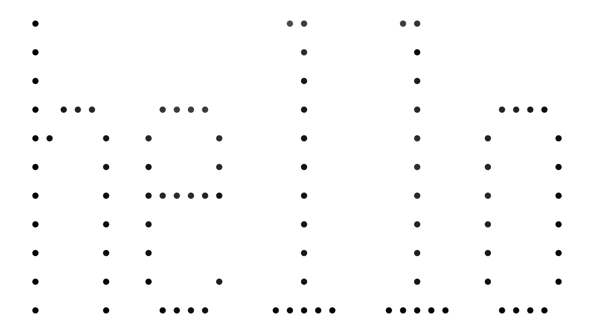
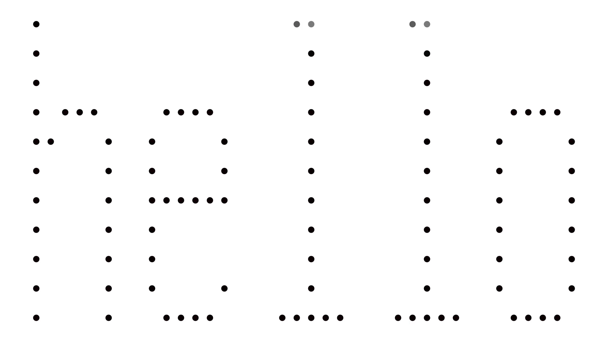

# Visualizations

The script [`scripts/anim/plotting.jl`](../../scripts/anim/plotting.jl) can be used
to generate pictures showing the transport from one string to another.

First, we can use a balanced optimal transport to visualize the difference between "hello" (spelled the usual way),
and "heIIo" (with uppercase eye's instead of lowercase ell's).


```julia
using VisualStringDistances
using UnbalancedOptimalTransport: KL, Balanced

include(joinpath(@__DIR__, "..", "plotting.jl"))
animate_words("hello", "heIIo"; D = Balanced(), normalize_density=true, save_path="hello_heIIo_balanced.gif")
```




We see that mass has to move from all the letters in order to create part of the I's. In contrast, let us
try an unbalanced method that instead allows creation or destruction of mass with a penalty.

```julia
animate_words("hello", "heIIo"; D = KL(1.0), save_path="hello_heIIo.gif")
```


